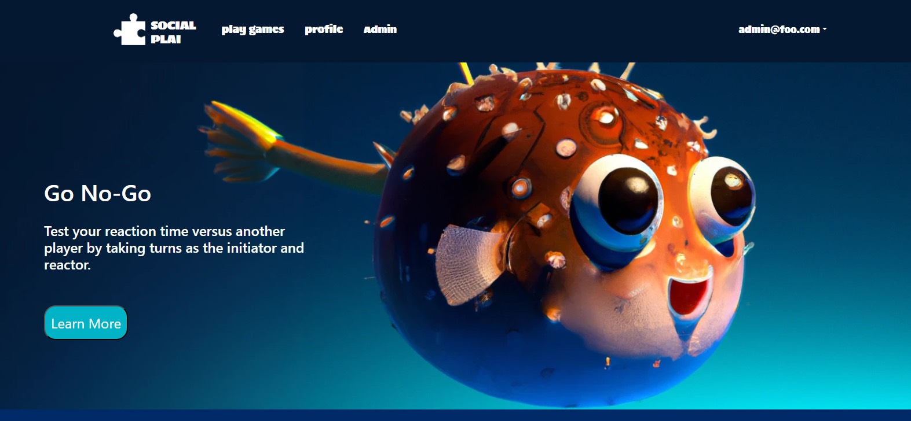
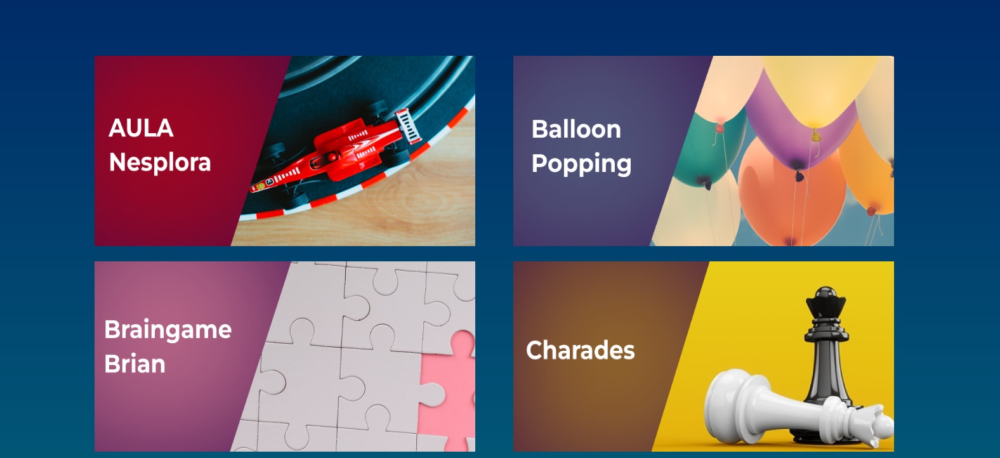
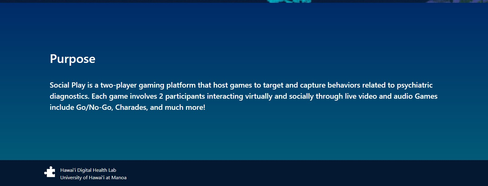
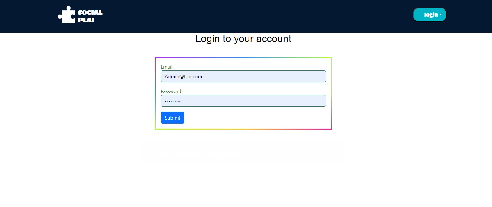
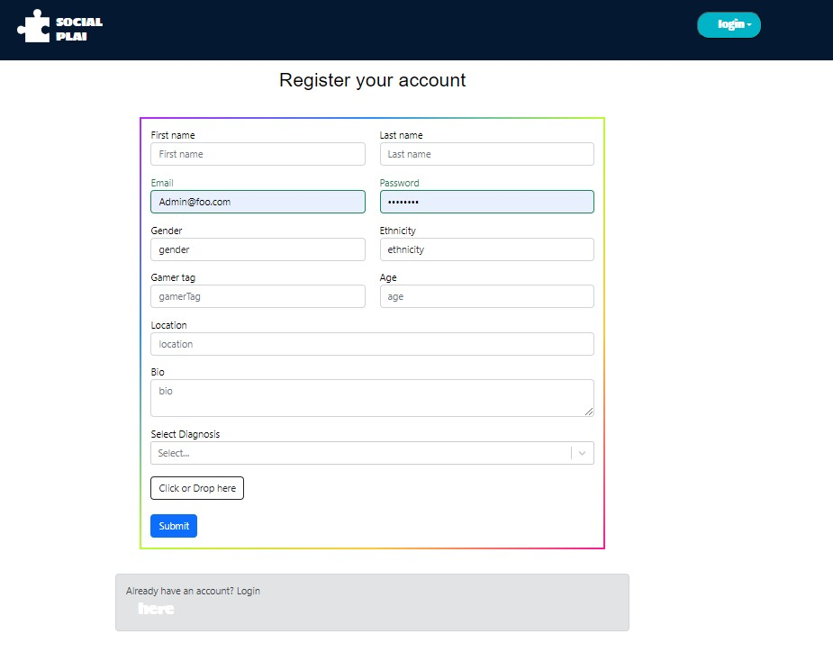

As a crucial team member, I spearheaded the design and implementation of the user interface and admin page for an innovative Social-Gaming-Web-Platform tailored to children with developmental delays. My unwavering commitment to quality included extensive testing using TestCafe, ensuring a flawless user experience. Leveraging JavaScript, HTML, CSS, React.js, and Bootstrap, I crafted a seamless and engaging landing page that introduces interactive games designed to capture and assess children's behavior. The landing page serves as a vibrant gateway, showcasing the diverse range of therapeutic games offered, each meticulously designed to support children's development and behavioral needs.

Sign-In Page:
The Sign-In Page is a secure entry point that prioritizes ease of access for both parents and guardians.  It features:
User-Friendly Interface: 
A visually appealing and child-friendly design with intuitive controls to facilitate a seamless sign-in process.  
Secure Authentication: 
Implementation of robust authentication protocols to ensure the privacy and security of user accounts, instilling confidence in parents and guardians. 
Personalized Profiles: 
Customizable profiles for each child, allow parents to track individual progress and tailor the gaming experience to specific developmental goals. 
Parental Controls: 
Inclusion of parental controls to manage and customize access levels, ensuring a safe and controlled environment for children.

Sign-Up Page: 
The Sign-Up Page serves as the gateway for new users, fostering a welcoming and informative onboarding experience: 
Guided Registration Process: 
A step-by-step registration process with clear instructions, guiding parents through the creation of individual profiles for their children. 
Informational Prompts: 
Informative prompts explaining the purpose of the platform, the benefits of therapeutic gaming, and how the platform supports developmental milestones. 
Customizable Preferences: 
Option for parents to set preferences based on their child's developmental needs, allowing the platform to recommend suitable games tailored to specific requirements. 
Privacy and Consent: 
Transparent communication about privacy measures and seeking parental consent for data collection, ensuring compliance with regulations and establishing trust.

Integration with Landing Page: 
Both the Sign-In and Sign-Up pages seamlessly integrate with the landing page: 
Unified Experience: 
Consistent design elements and visual cues across all pages to create a unified and cohesive user experience. 
Game Selection Preview: 
A sneak peek of available games on the sign-up page, enticing parents with the therapeutic and engaging content the platform offers. 
Clear Calls to Action: 
Prominent calls to action encourage users to explore games after sign-up or sign-in, fostering immediate engagement. 
In summary, the Sign-In and Sign-Up pages are thoughtfully designed to provide a secure and user-friendly experience for parents and guardians, ensuring accessibility while maintaining the highest standards of security and privacy. The integration with the landing page creates a seamless journey for users interested in leveraging the platform's therapeutic games for children with developmental delays.

<h3>Implementation Overview:</h3>

<h4>Sign-In Page:</h4>
Developed using JavaScript, HTML, CSS, React.js, and Bootstrap for a secure and child-friendly sign-in experience. Robust authentication protocols were implemented to ensure account security.
 
<h4>Sign-Up Page:</h4>
Crafted with JavaScript, HTML, CSS, React.js, and Bootstrap, featuring a guided registration process, informative prompts, and customizable preferences for a welcoming onboarding experience.
 
<h4>Integration with Landing Page:</h4>
Seamlessly integrated with JavaScript, HTML, CSS, React.js, and Bootstrap, ensuring a cohesive user experience across all pages and immediate access to therapeutic games for children.
 
<h4>Privacy and Security Measures:</h4>
Utilized secure authentication and communicated transparently about privacy measures during the sign-up process. Implemented in JavaScript, HTML, and CSS.
 
<h4>Parental Controls:</h4>
Integrated parental controls using JavaScript, HTML, CSS, React.js, and Bootstrap, allowing parents to manage and customize access levels for a safe gaming environment.
 
<h4>Game Selection Preview:</h4>
Integrated with JavaScript, HTML, CSS, React.js, and Bootstrap on the Sign-Up page, providing a glimpse of available therapeutic games to entice parents.
 
<h4>Clear Calls to Action:</h4>
Designed clear and prominent calls to action on both Sign-In and Sign-Up pages, encouraging users to explore and engage with the platform's therapeutic games. Developed with JavaScript, HTML, CSS, React.js, and Bootstrap.
 
<h4>Unified User Experience:</h4>
Maintained a consistent design language and visual cues across all pages using JavaScript, HTML, CSS, React.js, and Bootstrap, ensuring a unified and cohesive user experience.
 
<h4>Summary:</h4>
In summary, the implementation of the Sign-In and Sign-Up pages involved a stack comprising JavaScript, HTML, CSS, React.js, and Bootstrap, creating a secure, engaging, and accessible environment for parents and guardians exploring therapeutic games for children with developmental delays.

