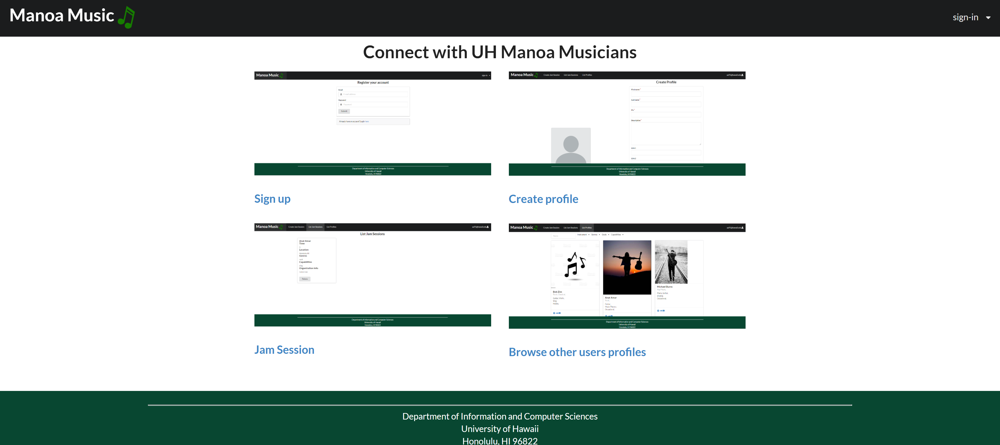
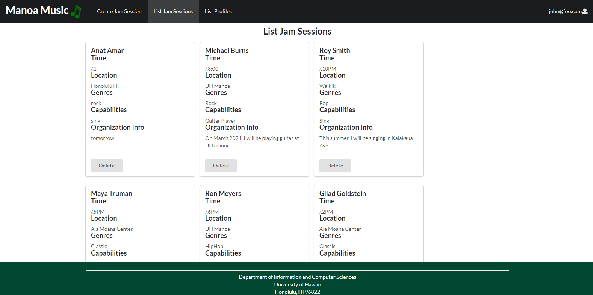

In the realm of Software Engineering, practical application of principles is paramount for mastery. I undertook an immersive journey by developing a dynamic website tailored to the vibrant community of musicians at the University of Hawaii at Manoa (UH Manoa). This platform fosters musical connections, enabling community members to create profiles, engage in jam sessions, and connect with fellow musicians through a personalized inbox messaging system.

Technological Stack: Meteor, React, and Semantic UI

Leveraging the robust Meteor framework alongside React for dynamic user interfaces and Semantic UI for seamless design, I orchestrated the creation of a feature-rich social network that seamlessly integrates into the musical landscape of UH Manoa.

Key Contributions: Crafting the User Experience

My primary responsibilities encompassed the design and implementation of pivotal features, including:

Landing and Profile Pages: I crafted an inviting landing page that serves as the user's gateway to the UH Manoa musical community. The profile pages were meticulously designed to showcase the uniqueness of each musician.

Jam Session Page: Contributing to the creation and curation of the jam session page, I ensured a user-friendly experience for musicians looking to collaborate and share their musical prowess.

Backend Magic: The backend functionality, seamlessly integrated into the landing page, offers users three compelling options: creating a profile, joining a jam session, and browsing other users' profiles. This intricate backend logic enhances user engagement and facilitates seamless navigation.

Intuitive Navigation: A user-friendly navigation system empowers users to switch effortlessly between the music page and the landing page. The UH Manoa music tab strategically placed in the upper left corner provides a convenient way to return to the landing page.

Landing Page Excellence: A Gateway to Musical Exploration

The landing page serves as the inaugural point of interaction, presenting four distinct links tailored for user convenience. For instance, the "Sign up" link seamlessly guides students through a registration process using their UH Manoa email addresses and secure passwords.

Next Steps: Elevating the Musical Experience

As the project evolves, future enhancements may include refining the user interface, introducing personalized recommendations, and expanding the collaborative capabilities of the jam session feature. This continuous evolution aligns with the dynamic nature of musical expression and community building.

Clarity of Purpose: Elevating User Experience

At the heart of my development endeavor was the pursuit of a crystal-clear user experience, particularly evident in the creation of the landing page. My primary objective was to ensure that new users could effortlessly discern the website's purpose and functionalities while maintaining seamless access to all its pages.

Strategic Design for Immediate Recognition

The focal point of my efforts was the development of a landing page that serves as an intuitive introduction to the website's offerings. The strategic placement of elements aimed to provide new users with an immediate understanding of the platform's intentions.

User-Friendly Navigation Post Sign-Up

Upon successfully signing up, users are presented with three prominent links, each serving a distinct purpose. These links are meticulously designed to guide users seamlessly through the website, ensuring an effortless transition to key pages.

A Glimpse into Post-Sign-Up Navigation:

Create Profile: Empowering users to showcase their musical identity by crafting personalized profiles.

Jam Session: Facilitating collaboration and creativity through a dedicated space for engaging in musical jam sessions.

Browse Profiles: Enabling users to explore the rich tapestry of the UH Manoa musical community by perusing the profiles of fellow musicians.

Clear Pathways for Musical Exploration

The landing page's design, coupled with these three fundamental links, creates a user-friendly pathway for individuals to immerse themselves in the musical journey offered by the website. The objective is to make the navigation process not only straightforward but also reflective of the rich and diverse musical experiences that the UH Manoa community has to offer.

Ongoing Commitment to User-Centric Design

As the website evolves, continuous attention will be directed toward refining and enhancing the user interface, ensuring that the website remains an inviting digital space for all members of the UH Manoa musical community.

In essence, the landing page serves as a welcoming gateway, offering a glimpse into the musical possibilities that await users within the interconnected realm of the UH Manoa Musicians Social Network.

Enhancing User Profiles: Crafting the "Create Profile" Experience

In addition to shaping the landing page, my second focal point was the seamless development of the "Create Profile" page. This page serves as a comprehensive platform where users can input a myriad of information, including their name, profile picture, and intricate details about their musical journey, goals, capabilities, instruments, and preferred genres. Moreover, users have the opportunity to share links to their artistic endeavors on YouTube, Spotify, and SoundCloud.

An In-Depth Profile Creation Process:

The "Create Profile" page is meticulously designed to guide users through a thoughtful and engaging process, ensuring that their musical identity is accurately represented. By providing a space for users to articulate their aspirations, skills, and musical preferences, this page becomes a canvas for self-expression within the UH Manoa Musicians Social Network.

Visibility on the "List Profile" Page: Connecting Musicians

Upon completion of the profile creation process, the user's profile seamlessly integrates into the broader musical community on the "List Profile" page. This centralized hub allows users to explore a curated list of UH Manoa musicians, facilitating connections and collaborations based on shared musical interests and goals.

A Collaborative Hub for Musical Networking:

Users can peruse the "List Profile" page to discover fellow musicians, fostering connections for various musical needs. Whether seeking collaborators for a project, exploring shared genres, or simply connecting with like-minded individuals, this page serves as a dynamic space for the UH Manoa musical community to unite and flourish.

Continual Refinement for Optimal User Experience:

As part of an ongoing commitment to user-centric design, the "Create Profile" and "List Profile" functionalities will evolve to meet the ever-changing needs of the UH Manoa Musicians Social Network. This iterative approach ensures that the platform remains a vibrant and inclusive space for musical exploration and collaboration.

In essence, the "Create Profile" page acts as a conduit for users to narrate their musical stories, while the "List Profile" page unfolds as a dynamic directory, weaving together the diverse talents within the UH Manoa musical community.

Certainly! Here's a refined version of your statement:

Leveraging Web Development Tools for Proficiency

Over the course of this project, my engagement with web development tools has been pivotal in enhancing my knowledge and skills in software development. Notably, I've adeptly utilized quality assurance practices, configuration management strategies, and meticulous project planning to ensure the project's success.

Technological Proficiency:

IDE Mastery: I've seamlessly navigated the development landscape using Intellij IDE, mastering its functionalities to streamline coding and enhance overall project efficiency.

UI Expertise: The integration of Semantic UI as a user interface framework has enriched my development experience. Its intuitive design principles have allowed me to craft visually appealing and user-friendly interfaces that resonate with the project's objectives.

Meteor Framework Mastery: The adoption of the Meteor web application framework has played a pivotal role in shaping the project's architecture. This powerful framework has not only facilitated rapid development but has also empowered the creation of a dynamic and responsive social network.

Testing Prowess with Test Cafe: Ensuring the robustness of web pages has been a priority, and I've gained valuable experience in testing through the implementation of Test Cafe. This testing tool has been instrumental in validating the functionality and performance of the developed web pages.

Holistic Approach to Project Development:

My engagement with these tools extends beyond mere technicalities. The project's success is not only attributed to the mastery of individual tools but also to a holistic approach that integrates quality assurance, configuration management, and strategic project planning.

For More Details:

For a deeper dive into the specifics of the project, including its objectives, methodologies, and outcomes, please refer to the following link.

This project has been a dynamic learning journey, enabling me to fuse theoretical knowledge with hands-on experience, ultimately contributing to a comprehensive skill set in the realm of software development.
  * [Manoa Music](https://github.com/manoa-music).
