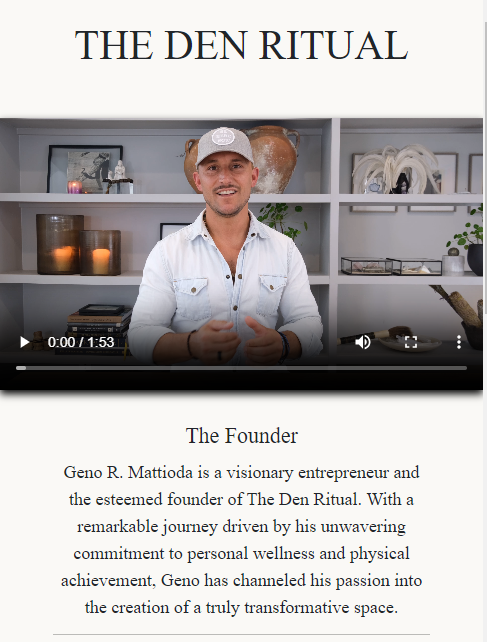
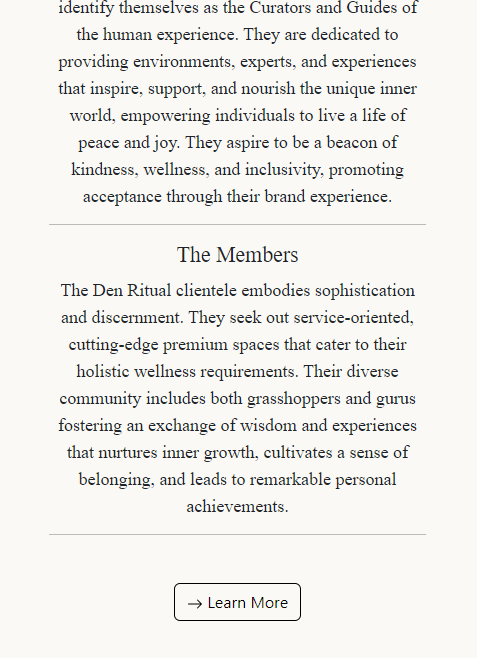
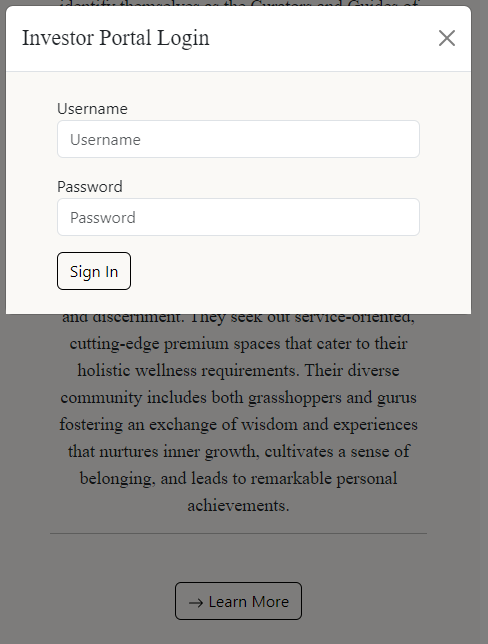
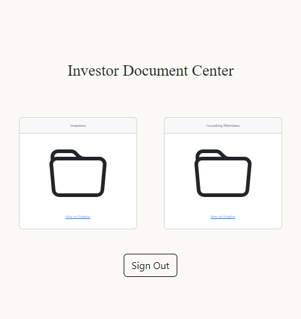

The landing page for The Den Social Wellness Club is meticulously designed with a specific focus on investors, providing them with a comprehensive overview of the founder, vision, and unique offerings of The Den Ritual.

Personalized Introduction from the Owner:
The landing page features an impactful video message from the owner, providing a personal touch to the investor experience. This video serves as a direct communication channel, allowing the owner to express the club's values, mission, and unique offerings, creating a compelling narrative for potential investors.

The landing page includes a strategically placed "Investor Login" button, inviting potential investors to explore exclusive insights. Upon clicking, a popup window emerges, offering a seamless transition to the investor login functionality. This secure portal ensures that investors have direct access to essential financial information, reports, and updates tailored to their specific interests.

The Secure Document Access Page serves as the culmination of the investor journey after a successful login, providing exclusive access to comprehensive documents that encapsulate everything about The Den Social Wellness Club.

This page acts as a confidential repository, offering a secure space where investors can delve deep into detailed documents that encapsulate the essence, strategies, and financial aspects of The Den Ritual. The commitment to confidentiality is paramount, ensuring that sensitive information is accessible only to authorized individuals.

Upon entering the Secure Document Access Page, investors are greeted with strategically organized content links. These links provide easy navigation to a wealth of information, covering diverse aspects of The Den's operations, financial performance, growth strategies, and future projections.

Source: <a href="https://www.thedenritual.com/"><i class="large github icon "></i>The Den Ritual Investor Website</a>
